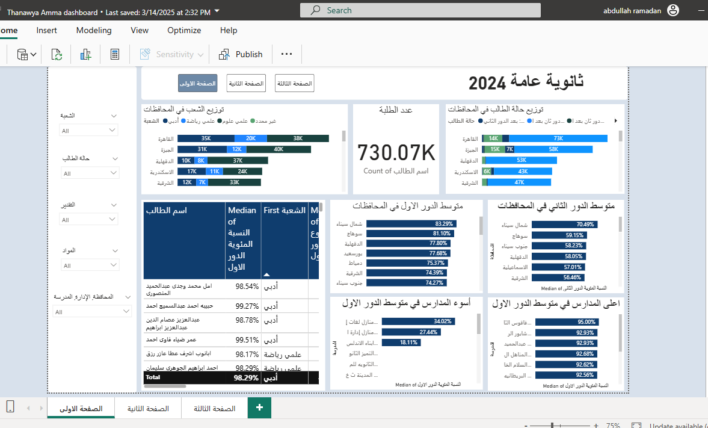

# Egyptian Thanawya Amma 2024 Dashboard  
📊 **Extracting, Cleaning, Visualizing, and Analyzing 700,000+ Egyptian Students' Results**

  

---

## 📌 Project Overview  
This project extracts and analyzes the results of more than **730,000 Egyptian Thanawya Amma students (2024)**.  

The workflow includes:  
- **Data Extraction**: Scraping student results from official result websites using **Python Scrapy**.  
- **Data Cleaning**: Handling missing values, ensuring data consistency, and preparing it for analysis.  
- **Data Visualization**: Creating an **interactive dashboard** in **Power BI** to explore results across subjects, total scores, and education systems (Old/New).  

---

## 🛠️ Tools & Technologies  
- **Python (Scrapy, Pandas)** – for web scraping and cleaning.  
- **Power BI** – for building the interactive dashboard.  
- **Excel / Power Query** – for additional preprocessing.  

---

## 📂 Project Files  
- `scraper.py` → Python script to scrape student results using scrapy framework (will be added soon).  
- `Thanawya2024.pbix` → Power BI dashboard file.  
- `results.csv` → Extracted raw data (will be added soon).  

---

## 📊 Dashboard Features  
The **Power BI Dashboard** provides:  
- 📈 **Subject-wise analysis** (Arabic, English, Math, Science, Humanities, etc.)  
- 🏫 **Comparison between Cities and Schools** (المحافظة, الادارة التعليمية و المدرسة).  
- 🎯 **Total score distributions** (histograms, percentiles, and KPIs).  
- 🔍 **Filters For subjects, sections, city, student_stat and more**.  
- 📊 **Insights into student performance** across 700,000+ records.  
